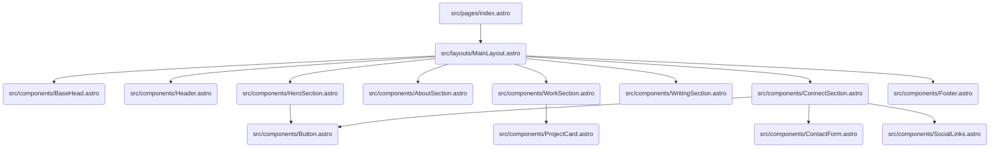

# Portfolio Website High-Level Plan (monokernel.com)

This document outlines the architectural plan for building the portfolio website
based on the design brief and existing Astro project structure.

**1. Site Structure & Layouts:**

- **Primary Structure:** A single-page layout seems most appropriate given the
  brief's sections (Hero, About, Work, Connect). This will be implemented
  primarily within `src/pages/index.astro`.
- **Writing Section:** _Decision pending on inclusion._ If included, potentially
  a separate page (e.g., `src/pages/writing.astro`) or integrated into the main
  page. Existing blog structure (`src/content/blog/`, etc.) to be removed or
  adapted.
- **Main Layout:** Create a new primary layout, e.g.,
  `src/layouts/MainLayout.astro`. This will replace the need for
  `src/layouts/BlogPost.astro` for the main page structure and will contain the
  common head, header, and footer elements.
- **Base Components:** Adapt existing components like
  `src/components/BaseHead.astro`, `src/components/Header.astro`, and
  `src/components/Footer.astro` to match the new design and structure.

**2. Component Structure:**

- Break down the UI into reusable Astro components for maintainability and
  clarity.

- **Proposed New Components:**
  - `src/components/HeroSection.astro`
  - `src/components/AboutSection.astro`
  - `src/components/WorkSection.astro`
  - `src/components/ProjectCard.astro` (for individual work items)
  - `src/components/WritingSection.astro` (if implemented)
  - `src/components/ConnectSection.astro`
  - `src/components/ContactForm.astro`
  - `src/components/SocialLinks.astro`
  - `src/components/Button.astro` (reusable button component)

**3. Styling Strategy (Using Tailwind CSS):**

- **Integration:** Add and configure the `@astrojs/tailwind` integration.
- **Base Styles:** Remove existing styles from `src/styles/global.css` and
  potentially delete the file if not needed for minimal base resets or font
  imports.
- **Tailwind Config:** Configure `tailwind.config.cjs` (or `.mjs`) to:
  - Enable dark mode (`darkMode: 'class'` or `'media'`).
  - Extend the theme with the specified color palette (electric blue, burnt
    orange, muted gray) and fonts (Space Mono, Inter/IBM Plex Sans).
- **Font Setup:** Download/import fonts and reference them in the Tailwind
  config and potentially a minimal global CSS file.
- **Utility Classes:** Apply Tailwind utility classes directly within Astro
  components for layout, typography, colors, and spacing.

**4. Configuration Changes:**

- **`astro.config.mjs`:**
  - Update `site` to `"https://monokernel.com"`.
  - Add `@astrojs/tailwind` to `integrations`.
  - Remove `@astrojs/rss` if blog functionality is replaced.
- **`package.json`:**
  - Add `@astrojs/tailwind` and `tailwindcss` as dependencies.
  - Remove `@astrojs/rss` if its integration is removed.
- **`tsconfig.json`:** Update paths if necessary.
- **Create `tailwind.config.cjs`:** Add Tailwind configuration file.

**5. Content Strategy:**

- **Hero:** Use tagline and subheadline directly from the brief
  (`ai/site-design/brief.md:26-28`).
- **About:** Requires drafting content based on the bullet points in the brief
  (`ai/site-design/brief.md:35-38`). Placeholder text initially.
- **Work:** Use project titles from the brief (`ai/site-design/brief.md:45-47`).
  Requires drafting descriptions, role/stack/impact details. Placeholder text
  initially. Images are optional.
- **Writing:** This section is optional. If included, content needs to be
  written or links to external sources provided
  (`ai/site-design/brief.md:57-61`). Placeholder initially.
- **Connect:** Requires actual GitHub, LinkedIn, Twitter URLs. Decision needed
  on contact form implementation and whether to include Calendly/direct email
  (`ai/site-design/brief.md:67-69`). Placeholder links/text initially.
- **Imagery:** Source or create images mentioned (terminal mockups, pizza, desk
  layout) (`ai/site-design/brief.md:92-95`).
